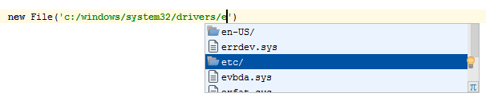
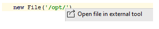
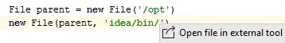

File name completion for Idea for groovy
========================================

Provides features:

*   File name completion
*   Open file by 'Goto declaration' standard shortcut
*   Open file in external tool
*   supported java and groovy

### Screenshots
File name completion :

Open file in external tool :

Parent support :

### Download
https://plugins.jetbrains.com/plugin/9510-file-completion-plugin

### License
https://www.apache.org/licenses/LICENSE-2.0
